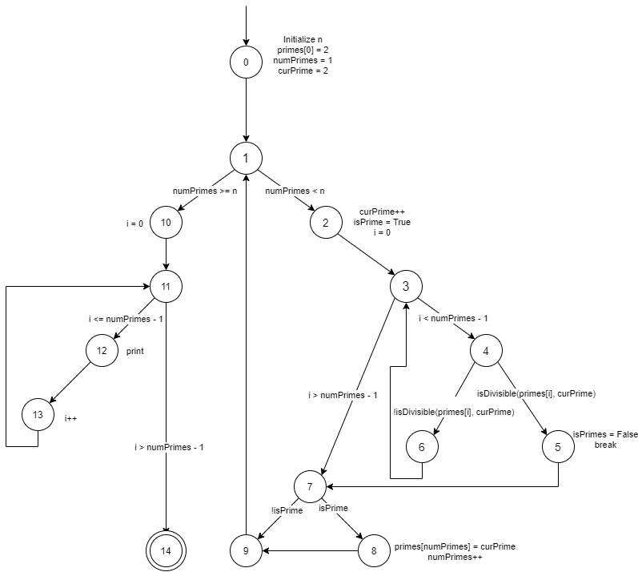

# Chapter 7 - Section 3 - Exercise 7
## Use the method printPrimes() for questions a–f below. A compilable version is available on the book website in the file PrintPrimes.java. A line-numbered version suitable for this exercise is available on the book website in the file PrintPrimes.num.

```Java
// Introduction to Software Testing
// Authors: Paul Ammann & Jeff Offutt
// Chapter 7; page ??
// Can be run from command line
// See PrintPrimes.num for a numbered version.
// No JUnit tests at this time

/** *****************************************************
* Finds and prints n prime integers
* Jeff Offutt, Spring 2003
********************************************************* */
public class PrintPrimes
{

   private static boolean isDivisible (int i, int j)
   {
      if (j%i == 0)
         return true;
      else
         return false;
   }
   private static void printPrimes (int n)
   {
      int curPrime;           // Value currently considered for primeness
      int numPrimes;          // Number of primes found so far.
      boolean isPrime;        // Is curPrime prime?
      int [] primes = new int [100]; // The list of prime numbers.
    
      // Initialize 2 into the list of primes.
      primes [0] = 2;
      numPrimes = 1;
      curPrime  = 2;
      while (numPrimes < n)
      {
         curPrime++;  // next number to consider ...
         isPrime = true;
         for (int i = 0; i <= numPrimes-1; i++)
         {   // for each previous prime.
            if (isDivisible (primes[i], curPrime))
            {  // Found a divisor, curPrime is not prime.
               isPrime = false;
               break; // out of loop through primes.
            }
         }
         if (isPrime)
         {   // save it!
            primes[numPrimes] = curPrime;
            numPrimes++;
         }
      }  // End while
   
      // Print all the primes out.
      for (int i = 0; i <= numPrimes-1; i++)
      {
         System.out.println ("Prime: " + primes[i]);
      }
   }  // end printPrimes
   
   public static void main (String []argv)
   {  // Driver method for printPrimes
      // Read an integer from standard input, call printPrimes()
      int integer = 0;
      if (argv.length != 1)
      {
         System.out.println ("Usage: java PrintPrimes v1 ");
         return;
      }
   
      try
      {
         integer = Integer.parseInt (argv[0]);
      }
      catch (NumberFormatException e)
      {
         System.out.println ("Entry must be a integer, using 1.");
         integer = 1;
      }
   
      printPrimes (integer);
   }
}
```

### (a) Draw the control flow graph for the printPrimes() method.


### (b) Consider test cases t1 = (n = 3) and t2 = (n = 5). Although these tour the same prime paths in printPrimes(), they do not necessarily find the same faults. Design a simple fault that t2 would be more likely to discover than t1 would.

### (c) For printPrimes(), find a test case such that the corresponding test path visits the edge that connects the beginning of the while statement to the for statement that appears after the while loop, without going through the body of the while loop.

I think the edge that connect the two is edge (0,1) where the program decides which path to go. Before excuting the *for* loop, we must still run the beginning of the *while* loop to see if *n < numPrimes*. In order not to execute the *while* loop, **n = 1** should does the job.

### (d) List the test requirements for Node Coverage, Edge Coverage, and Prime Path Coverage.
> Node Coverage: {0,1,2,3,4,5,6,7,8,9,10,11,12,13,14}
> Edge Coverage: {(0,1),(1,2),(1,10),(2,3),(3,4),(3,7),(4,5),(4,6),(5,7),(6,3),(7,8),(7,9),(8,9),(9,1),(10,11),(11,12),(11,14),(12,13),(13,11)}
> Prime Path Coverage: 
- [0, 1, 2, 3, 4, 5, 7, 8, 9]
- [0, 1, 2, 3, 4, 5, 7, 9]
- [0, 1, 2, 3, 4, 6]
- [0, 1, 2, 3, 7, 8, 9]
- [0, 1, 2, 3, 7, 9]
- [0, 1, 10, 11, 12, 13]
- [0, 1, 10, 11, 14]
- [2, 3, 4, 5, 7, 8, 9, 1, 10, 11, 14]
- [2, 3, 4, 5, 7, 8, 9, 1, 10, 11, 12, 13]
- [2, 3, 4, 5, 7, 9, 1, 10, 11, 14]
- [2, 3, 4, 5, 7, 9, 1, 10, 11, 12, 13]
- [2, 3, 7, 8, 9, 1, 10, 11, 14]
- [2, 3, 7, 8, 9, 1, 10, 11, 12, 13]
- [2, 3, 7, 9, 1, 10, 11, 14]
- [2, 3, 7, 9, 1, 10, 11, 12, 13]
- [4, 6, 3, 7, 8, 9, 1, 10, 11, 14]
- [4, 6, 3, 7, 8, 9, 1, 10, 11, 12, 13]
- [4, 6, 3, 7, 9, 1, 10, 11, 14]
- [4, 6, 3, 7, 9, 1, 10, 11, 12, 13]
- [12, 13, 11, 14]
- [1, 2, 3, 4, 5, 7, 8, 9, 1] 
- [1, 2, 3, 4, 5, 7, 9, 1]
- [1, 2, 3, 7, 8, 9, 1]
- [1, 2, 3, 7, 1]
- [3, 4, 6, 3]
- [11, 12, 13, 11]

### (e) List test paths that achieve Node Coverage but not Edge Coverage on the graph.
All feasible test paths that achieve Node Coverage happens to achieve Edge Coverage also.
[0,1,2,3,4,6,3,4,5,7,8,9,1,10,11,12,13,11,14] would achive Node Coverage but not Edge Coverage. This path does not cover 2 edges (3,7) and (7,9); however, this path is infeasible.

### (f) List test paths that achieve Edge Coverage but not Prime Path Coverage on the graph.
[0,1,2,3,4,6,3,7,8,9,1,2,3,4,5,7,9,1,2,3,4,6,3,4,6,3,7,8,9,1,10,11,12,13,11,12,13,11,12,13,11,14]

This is the test path for when *n=3*. As you can see, this test path cover all edges, but 2 prime paths [0,1,10,11,14] and [0,1,10,11,12,13] are missing. So this path achieve Edge Coverage but not Prime Path Coverage