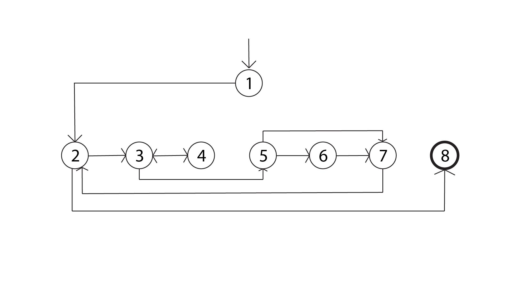
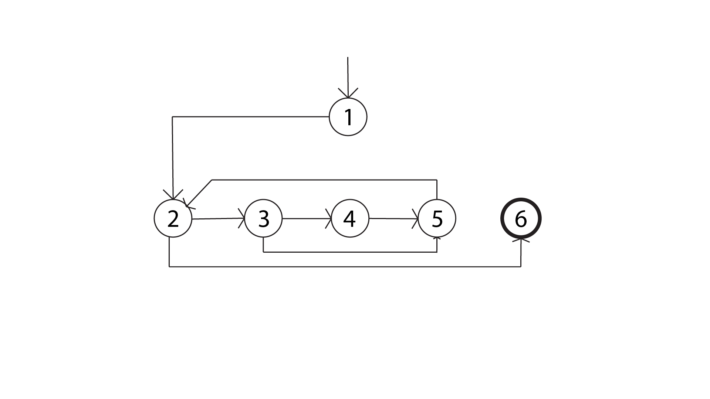

# Section 7.2.3
----------------
## Exercise  1

### Graph 1
(a)

---
(b)
There will be 5 du paths:
a=(1,2,8)
b=(1,2,3,5,6)
c=(4,3,5,6)
d=(4,3,5,7,2,8)
e=(4,3,5,6,7,2,8)
---
(c)
| path | direct | with sidetrip |
|---|---|---|
| t1|a||
|t2||a|
|t3|b|a|
|t4|d||
|t5|c,d||
|t6||c,d,e|
---
(d)
There are many paths:
(t1,t4),(t1,t5),(t3,t4),(t3,t5)
---
(e)
(t1,t3,y5)
---
(f)
(t1,t3,t4,t5)
---
### Graph 2
(a)

---
(b)
There will be 6 du paths:
a=(1,2,6)
b=(1,2,3)
c=(3,5,2,3)
d=(3,5,2,6)
e=(3,4,5,2,3)
f=(3,4,5,2,6)
---
(c)
|   | direct | with sidetrip |
|---|---|---|
| t1|a||
|t2|b,e|d|
|t3|b,d,f||
|t4|a,d||
---
(d)
(t4)
---
(e)
(t1,t2)
---
(f)
(t1,t2,t3)
---
### Graph 3
(a) same as graph 2
---
(b)
a=(1,2,6)
b=(1,2,3)
c=(1,2,3,5)
d=(4,5)
e=(4,5,2,3)
f=(4,5,2,6)
---
(c)
|   | direct | with sidetrip |
|---|---|---|
| t1|b,c|a|
|t2|b,d,f||
---
(d)
(t2)
---
(e)
(t1,t2,[1,2,6],[1,2,3,4,5,2,3,5,2,6])
---
(f)
same as (e) as all du-paths covergae covers all uses-coverage.
---
### Graph 4
(a) same as graph 2,3
---
(b)
a=(1,2,6)
b=(1,2,3,5)
c=(1,2,4,5)
d=(5,2,6)
e=(5,2,3,5)
f=(5,2,3,4,5)
--d
(c)
|   | direct | with sidetrip |
|---|---|---|
| t1|a||
|t2|c,e,d||
|t3|b,f,d||
---
(d)
(t2)
---
(e)
(t1,t2)
---
(f)
(t1,t2,t3)